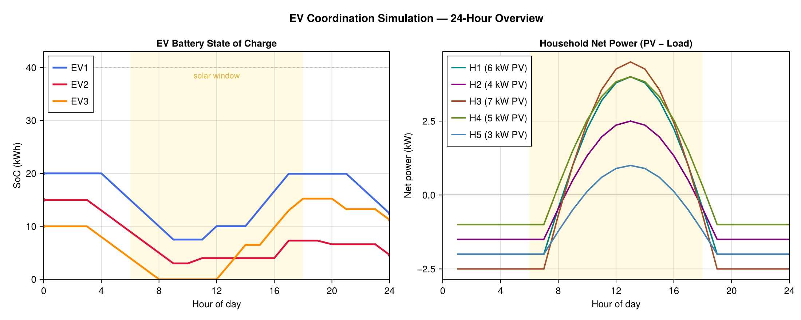
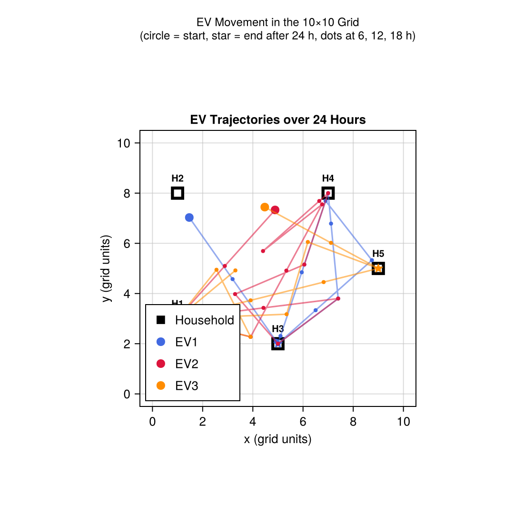

# Tutorial: Electric Vehicle Coordination in a Smart Grid

This tutorial builds an agent-based simulation of electric vehicles (EVs) acting as mobile energy storages in a small neighbourhood. Households with photovoltaic (PV) generators produce surplus energy at midday; the objective is to have EVs collect that surplus and deliver it to households with a deficit — maximising local self-consumption and reducing grid exchange.

This scenario combines every major simulation feature in one example: the **`Area2D` space** for spatial positioning, **`on_step`** for physics-based movement and energy balance, **message passing** for decentralised coordination, and **data recording** for result analysis. Note, that this is a toy example, created to demonstrate the capabilities of Mango.jl.

!!! tip "Prerequisites"
    Read the [Simulation](@ref) reference page before this tutorial. A working knowledge of [Agents](@ref), [Roles](@ref), and the [Tutorial: Ping-Pong in Simulation](@ref) is assumed.

---

## Scenario

```
  (0,10) ─────────────────── (10,10)
    │  H2(1,8)     H4(7,8)      │
    │                           │
    │     EV1  EV2  EV3         │
    │                           │
    │  H1(1,3)     H5(9,5)      │
    │         H3(5,2)           │
  (0,0)  ─────────────────── (10,0)
```

- **5 households** at fixed positions — each has a rooftop PV installation and a constant load.
- **3 EVs** that can move freely in the 2D grid — each carries a battery that can be charged at a surplus household and discharged at a deficit one.
- **1 coordinator** that collects net-power reports from all households every hour and dispatches EVs to the most urgent locations.

A **1-hour time step** is used. Simulated time starts at midnight on a sunny summer day (solar irradiance peaks around noon).

---

## Step 1 — Message Types

All coordination messages are plain Julia structs. No special Mango annotations are needed.

```julia
using Mango, Dates

# Sent by a household to the coordinator every step.
struct NetPowerReport
    sender_aid::String        # AID of the reporting household
    net_power_kw::Float64     # positive = surplus, negative = deficit
    position::Position2D      # where the household sits in the grid
end

# Sent by the coordinator to an EV.
struct EVAssignment
    target::Position2D        # where to go
    action::Symbol            # :charge or :discharge
    power_kw::Float64         # rate while at target
end
```

---

## Step 2 — Household Agent

Each household tracks its cumulative grid exchange. Its `on_step` hook computes the hourly energy balance and reports the current net power to the coordinator.

```julia
@agent struct HouseholdAgent
    pv_peak_kw::Float64       # peak PV capacity
    load_kw::Float64          # constant load
    grid_import_kwh::Float64  # cumulative energy bought from grid
    grid_export_kwh::Float64  # cumulative energy sold to grid
    self_consumed_kwh::Float64
    coordinator::AgentAddress
end

# Sinusoidal PV profile: peak at solar noon (hour 12), zero before 6 and after 18.
function pv_output_kw(agent::HouseholdAgent, t::DateTime)
    h = Dates.hour(t) + Dates.minute(t) / 60.0
    return max(0.0, agent.pv_peak_kw * sin(π * (h - 6.0) / 12.0))
end

import Mango.on_step

function on_step(agent::HouseholdAgent, env::Environment, clock::Clock, step_size_s::Real)
    step_h   = step_size_s / 3600.0
    pv       = pv_output_kw(agent, clock.simulation_time)
    net      = pv - agent.load_kw   # +surplus / -deficit

    if net >= 0.0
        agent.self_consumed_kwh += agent.load_kw * step_h
        agent.grid_export_kwh   += net * step_h
    else
        agent.self_consumed_kwh += pv * step_h
        agent.grid_import_kwh   += (-net) * step_h
    end

    # Report current net power and position to the coordinator.
    pos = location(env.space, agent)
    send_message(agent, NetPowerReport(aid(agent), net, pos), agent.coordinator)
end
```

!!! note "Step ordering"
    `on_step` is called for every agent before any message is delivered within a step. Messages sent by households in step *N* are received by the coordinator in the same step *N* (zero-delay), but the coordinator's own `on_step` for step *N* has already run. The coordinator therefore dispatches EVs based on reports from the **previous** step — a realistic one-step coordination lag.

---

## Step 3 — EV Agent

An EV moves through the `Area2D` space at a fixed speed. When it reaches the assigned target it charges or discharges its battery. New assignments from the coordinator update the target and action.

```julia
@agent struct EVAgent
    capacity_kwh::Float64
    soc_kwh::Float64
    max_power_kw::Float64
    speed::Float64                          # grid units per hour
    target::Union{Position2D, Nothing}
    action::Symbol                          # :idle, :charge, or :discharge
    assigned_power_kw::Float64
end

function on_step(agent::EVAgent, env::Environment, clock::Clock, step_size_s::Real)
    isnothing(agent.target) && return

    step_h  = step_size_s / 3600.0
    current = location(env.space, agent)
    dx      = agent.target.x - current.x
    dy      = agent.target.y - current.y
    dist    = sqrt(dx^2 + dy^2)

    max_travel = agent.speed * step_h

    if dist <= max_travel
        # Arrived — snap to target and perform energy exchange.
        move(env.space, agent, agent.target)
        energy_kwh = agent.assigned_power_kw * step_h
        if agent.action == :charge
            agent.soc_kwh = min(agent.capacity_kwh, agent.soc_kwh + energy_kwh)
        elseif agent.action == :discharge
            agent.soc_kwh = max(0.0, agent.soc_kwh - energy_kwh)
        end
    else
        # Still en route — advance toward target.
        ratio   = max_travel / dist
        new_pos = Position2D(current.x + dx * ratio, current.y + dy * ratio)
        move(env.space, agent, new_pos)
    end
end

import Mango.handle_message

function handle_message(agent::EVAgent, msg::EVAssignment, ::AbstractDict)
    agent.target           = msg.target
    agent.action           = msg.action
    agent.assigned_power_kw = msg.power_kw
end
```

---

## Step 4 — Coordinator Agent

The coordinator collects net-power reports and, on each `on_step`, sends one assignment per EV. Surpluses are ranked by size (most urgent first), deficits by depth. Each EV gets exactly one target: the top-surplus locations are filled first, then remaining EV slots go to top-deficit locations.

```julia
@agent struct CoordinatorAgent
    powers::Dict{String, Float64}       # aid → latest net power (kW)
    positions::Dict{String, Position2D} # aid → household position
    ev_addresses::Vector{AgentAddress}
end

function handle_message(agent::CoordinatorAgent, msg::NetPowerReport, ::AbstractDict)
    agent.powers[msg.sender_aid]    = msg.net_power_kw
    agent.positions[msg.sender_aid] = msg.position
end

function on_step(agent::CoordinatorAgent, env::Environment, clock::Clock, step_size_s::Real)
    isempty(agent.powers) && return

    # Rank households by urgency.
    surpluses = sort([(k, v) for (k, v) in agent.powers if v  >  0.3],
                     by = x -> -x[2])   # descending
    deficits  = sort([(k, v) for (k, v) in agent.powers if v < -0.3],
                     by = x ->  x[2])   # ascending (most negative first)

    n = length(agent.ev_addresses)
    n == 0 && return

    # One assignment per EV — surpluses first, then deficits to fill remaining slots.
    ev_idx = 1
    for (haid, power) in surpluses
        ev_idx > n && break
        send_message(agent,
            EVAssignment(agent.positions[haid], :charge, min(power, 3.3)),
            agent.ev_addresses[ev_idx])
        ev_idx += 1
    end
    for (haid, power) in deficits
        ev_idx > n && break
        send_message(agent,
            EVAssignment(agent.positions[haid], :discharge, min(-power, 3.3)),
            agent.ev_addresses[ev_idx])
        ev_idx += 1
    end
end
```

!!! note "Why one assignment per EV?"
    `handle_message` overwrites the EV's target on every call. Sending more messages than there are EVs (as a naïve round-robin does) means some EVs receive two conflicting assignments in the same step — only the *last* one takes effect, which corresponds to a *lower-ranked* location. By capping at `n` messages, each EV gets exactly the most urgent available target.

---

## Step 5 — World Setup and Spatial Placement

Create a `World` with a 10×10 `Area2D` space and zero message delay (all reports arrive in the same step they are sent).

```julia
world = create_world(
    DateTime(2025, 6, 21),   # summer solstice — maximum daylight
    communication_sim = SimpleCommunicationSimulation(default_delay_s=0),
    space             = Area2D(width=10.0, height=10.0),
)
```

Register the coordinator first, then the households (they need the coordinator's address), then the EVs.

```julia
coord = register(world, CoordinatorAgent(Dict{String,Float64}(), Dict{String,Position2D}(), AgentAddress[]))

h1 = register(world, HouseholdAgent(6.0, 2.0, 0.0, 0.0, 0.0, address(coord)))
h2 = register(world, HouseholdAgent(4.0, 1.5, 0.0, 0.0, 0.0, address(coord)))
h3 = register(world, HouseholdAgent(7.0, 2.5, 0.0, 0.0, 0.0, address(coord)))
h4 = register(world, HouseholdAgent(5.0, 1.0, 0.0, 0.0, 0.0, address(coord)))
h5 = register(world, HouseholdAgent(3.0, 2.0, 0.0, 0.0, 0.0, address(coord)))

ev1 = register(world, EVAgent(40.0, 20.0, 3.3, 3.0, nothing, :idle, 0.0))
ev2 = register(world, EVAgent(40.0, 15.0, 3.3, 3.0, nothing, :idle, 0.0))
ev3 = register(world, EVAgent(40.0, 10.0, 3.3, 3.0, nothing, :idle, 0.0))

push!(coord.ev_addresses, address(ev1), address(ev2), address(ev3))
```

Inside the `activate` block, the `Area2D` space is initialised (agents receive random positions). Override the household positions to their fixed grid locations. EVs keep their random starting positions.

```julia
activate(world) do
    # Fix household positions — buildings don't move.
    household_positions = [
        (h1, Position2D(1.0, 3.0)),
        (h2, Position2D(1.0, 8.0)),
        (h3, Position2D(5.0, 2.0)),
        (h4, Position2D(7.0, 8.0)),
        (h5, Position2D(9.0, 5.0)),
    ]
    for (h, pos) in household_positions
        move(world.env.space, h, pos)
    end

    # ...recording and stepping (see Step 6)
end
```

---

## Step 6 — Data Recording and Running

Set up recordings before stepping. Four metrics are tracked:

| Recording | Function | What is measured |
|---|---|---|
| `"soc"` | `record_agent!` | Battery state-of-charge (kWh) per EV |
| `"import"` | `record_agent!` | Cumulative grid import (kWh) per household |
| `"self_consumed"` | `record_agent!` | Cumulative self-consumed PV energy (kWh) per household |
| `"positions"` | `record_position!` | `Position2D` snapshot per EV after each step |

```julia
activate(world) do
    for (h, pos) in household_positions
        move(world.env.space, h, pos)
    end

    # record_agent! runs on ALL registered agents, so guard each lambda by type.
    record_agent!(a -> a isa EVAgent ? a.soc_kwh           : nothing, world, "soc")
    record_agent!(a -> a isa HouseholdAgent ? a.grid_import_kwh   : nothing, world, "import")
    record_agent!(a -> a isa HouseholdAgent ? a.self_consumed_kwh : nothing, world, "self_consumed")
    record_agent!(a -> a isa HouseholdAgent ? a.grid_export_kwh   : nothing, world, "export")

    # record_position! snapshots every EVAgent's Position2D after each step automatically.
    record_position!(world, filter = a -> a isa EVAgent)

    # Simulate 24 hours with 1-hour fixed steps.
    for _ in 1:24
        step_simulation(world, 3600.0)
    end
end
```

After the simulation completes, inspect the results:

```julia
soc_data  = data_agent_collection(world, "soc")
imp_data  = data_agent_collection(world, "import")
sc_data   = data_agent_collection(world, "self_consumed")

println("=== EV state of charge over 24 h ===")
for ev in [ev1, ev2, ev3]
    println("  $(aid(ev)): $(round.(soc_data.timeseries[aid(ev)], digits=1)) kWh")
end

println("\n=== Household grid import (total) ===")
for h in [h1, h2, h3, h4, h5]
    total_import = last(imp_data.timeseries[aid(h)])
    total_sc     = last(sc_data.timeseries[aid(h)])
    scr = round(100 * total_sc / (total_sc + total_import), digits=1)
    println("  $(aid(h)): import=$(round(total_import, digits=2)) kWh  self-consumption=$(scr)%")
end
```

---

## Step 7 — Plotting the Results

Use [CairoMakie.jl](https://docs.makie.org/stable/) (or any compatible Makie backend) to visualise the simulation output. The examples below assume the recordings and trajectory tracking from Steps 6 are already in scope.

### EV state of charge and household net power

```julia
using CairoMakie

ev_agents = [ev1, ev2, ev3]
ev_colors = [:royalblue, :crimson, :darkorange]
ev_labels = ["EV1", "EV2", "EV3"]

h_agents      = [h1, h2, h3, h4, h5]
h_colors      = [:teal, :purple, :sienna, :olivedrab, :steelblue]
h_labels_long = ["H1 (6 kW PV)", "H2 (4 kW PV)", "H3 (7 kW PV)",
                 "H4 (5 kW PV)", "H5 (3 kW PV)"]

soc_data = data_agent_collection(world, "soc")
imp_data = data_agent_collection(world, "import")
ex_data  = data_agent_collection(world, "export")

hours = 0:24

fig = Figure(size=(1100, 440), fontsize=13)

# Left panel — EV state of charge
axA = Axis(fig[1, 1];
    title="EV Battery State of Charge", xlabel="Hour of day", ylabel="SoC (kWh)",
    xticks=0:4:24)
vspan!(axA, 6, 18; color=(:gold, 0.12))
hlines!(axA, [40]; color=(:gray, 0.4), linestyle=:dash, linewidth=1)
for (ev, col, lbl) in zip(ev_agents, ev_colors, ev_labels)
    soc = soc_data.timeseries[aid(ev)]
    lines!(axA, hours, soc; color=col, linewidth=2.5, label=lbl)
end
axislegend(axA; position=:lt)
xlims!(axA, 0, 24);  ylims!(axA, 0, 43)

# Right panel — household net power
axB = Axis(fig[1, 2];
    title="Household Net Power (PV − Load)", xlabel="Hour of day", ylabel="Net power (kW)",
    xticks=0:4:24)
hlines!(axB, [0]; color=:black, linewidth=0.8)
vspan!(axB, 6, 18; color=(:gold, 0.12))
for (h, col, lbl) in zip(h_agents, h_colors, h_labels_long)
    imp = imp_data.timeseries[aid(h)]
    ex  = ex_data.timeseries[aid(h)]
    net = [(ex[t] - ex[t-1]) - (imp[t] - imp[t-1]) for t in eachindex(imp)[2:end]]
    lines!(axB, 1:24, net; color=col, linewidth=2.0, label=lbl)
end
axislegend(axB; position=:lt)
xlims!(axB, 0, 24)

Label(fig[0, :]; text="EV Coordination Simulation — 24-Hour Overview",
      fontsize=15, font=:bold)
```

**Result:**



The left panel shows each EV's battery level over the day. All three EVs charge during the solar surplus window (shaded, roughly 08:00–16:00) and some discharge at deficit households in the early morning and evening. The right panel confirms the expected sinusoidal PV profile: deep deficit at night, strong surplus around noon.

### EV trajectories in the 2D grid

Position snapshots were already collected by `record_position!` in Step 6. Retrieve the history and plot:

```julia
pos_data = position_history(world)   # AgentsRecording with timeseries[aid] => Vector{Position2D}

fig2 = Figure(size=(540, 540), fontsize=13)
axT  = Axis(fig2[1, 1];
    title="EV Trajectories over 24 Hours",
    xlabel="x (grid units)", ylabel="y (grid units)",
    aspect=DataAspect(), xticks=0:2:10, yticks=0:2:10)

h_labels = ["H1", "H2", "H3", "H4", "H5"]
for (lbl, (_, pos)) in zip(h_labels, household_positions)
    scatter!(axT, [pos.x], [pos.y]; color=:black, markersize=22, marker=:rect)
    scatter!(axT, [pos.x], [pos.y]; color=:white, markersize=12, marker=:rect)
    text!(axT, pos.x, pos.y + 0.6; text=lbl, fontsize=10, align=(:center,:center), font=:bold)
end
scatter!(axT, [NaN], [NaN]; color=:black, markersize=14, marker=:rect, label="Household")

for (ev, col, lbl) in zip(ev_agents, ev_colors, ev_labels)
    track = pos_data.timeseries[aid(ev)]   # Vector{Position2D}, one entry per step
    xs = [p.x for p in track];  ys = [p.y for p in track]
    lines!(axT, xs, ys; color=(col, 0.55), linewidth=1.6)
    scatter!(axT, [xs[1]],   [ys[1]];   color=col, markersize=10, marker=:circle,
             strokecolor=col, strokewidth=2, label=lbl)
    scatter!(axT, [xs[end]], [ys[end]]; color=col, markersize=12, marker=:star5)
end

axislegend(axT; position=:lb)
limits!(axT, -0.5, 10.5, -0.5, 10.5)
```

**Result:**



Each coloured path shows where one EV traveled over 24 hours. The filled circle marks the random starting position; the star marks the final position. The EVs cluster around the households with the strongest surplus (H1, H2, H3 — high PV peak) during daylight hours, then shift toward deficit locations as the sun sets.

---

## Complete Standalone Script

```julia
using Mango, Dates

# ── Message types ────────────────────────────────────────────────────────────

struct NetPowerReport
    sender_aid::String
    net_power_kw::Float64
    position::Position2D
end

struct EVAssignment
    target::Position2D
    action::Symbol
    power_kw::Float64
end

# ── Household ────────────────────────────────────────────────────────────────

@agent struct HouseholdAgent
    pv_peak_kw::Float64
    load_kw::Float64
    grid_import_kwh::Float64
    grid_export_kwh::Float64
    self_consumed_kwh::Float64
    coordinator::AgentAddress
end

function pv_output_kw(agent::HouseholdAgent, t::DateTime)
    h = Dates.hour(t) + Dates.minute(t) / 60.0
    return max(0.0, agent.pv_peak_kw * sin(π * (h - 6.0) / 12.0))
end

import Mango.on_step

function on_step(agent::HouseholdAgent, env::Environment, clock::Clock, step_size_s::Real)
    step_h = step_size_s / 3600.0
    pv     = pv_output_kw(agent, clock.simulation_time)
    net    = pv - agent.load_kw

    if net >= 0.0
        agent.self_consumed_kwh += agent.load_kw * step_h
        agent.grid_export_kwh   += net * step_h
    else
        agent.self_consumed_kwh += pv * step_h
        agent.grid_import_kwh   += (-net) * step_h
    end

    pos = location(env.space, agent)
    send_message(agent, NetPowerReport(aid(agent), net, pos), agent.coordinator)
end

# ── EV ───────────────────────────────────────────────────────────────────────

@agent struct EVAgent
    capacity_kwh::Float64
    soc_kwh::Float64
    max_power_kw::Float64
    speed::Float64
    target::Union{Position2D, Nothing}
    action::Symbol
    assigned_power_kw::Float64
end

function on_step(agent::EVAgent, env::Environment, clock::Clock, step_size_s::Real)
    isnothing(agent.target) && return

    step_h  = step_size_s / 3600.0
    current = location(env.space, agent)
    dx      = agent.target.x - current.x
    dy      = agent.target.y - current.y
    dist    = sqrt(dx^2 + dy^2)

    max_travel = agent.speed * step_h

    if dist <= max_travel
        move(env.space, agent, agent.target)
        energy_kwh = agent.assigned_power_kw * step_h
        if agent.action == :charge
            agent.soc_kwh = min(agent.capacity_kwh, agent.soc_kwh + energy_kwh)
        elseif agent.action == :discharge
            agent.soc_kwh = max(0.0, agent.soc_kwh - energy_kwh)
        end
    else
        ratio = max_travel / dist
        move(env.space, agent,
            Position2D(current.x + dx * ratio, current.y + dy * ratio))
    end
end

import Mango.handle_message

function handle_message(agent::EVAgent, msg::EVAssignment, ::AbstractDict)
    agent.target            = msg.target
    agent.action            = msg.action
    agent.assigned_power_kw = msg.power_kw
end

# ── Coordinator ───────────────────────────────────────────────────────────────

@agent struct CoordinatorAgent
    powers::Dict{String, Float64}
    positions::Dict{String, Position2D}
    ev_addresses::Vector{AgentAddress}
end

function handle_message(agent::CoordinatorAgent, msg::NetPowerReport, ::AbstractDict)
    agent.powers[msg.sender_aid]    = msg.net_power_kw
    agent.positions[msg.sender_aid] = msg.position
end

function on_step(agent::CoordinatorAgent, env::Environment, clock::Clock, step_size_s::Real)
    isempty(agent.powers) && return

    surpluses = sort([(k, v) for (k, v) in agent.powers if v  >  0.3], by = x -> -x[2])
    deficits  = sort([(k, v) for (k, v) in agent.powers if v < -0.3], by = x ->  x[2])

    n = length(agent.ev_addresses)
    n == 0 && return

    ev_idx = 1
    for (haid, power) in surpluses
        ev_idx > n && break
        send_message(agent,
            EVAssignment(agent.positions[haid], :charge, min(power, 3.3)),
            agent.ev_addresses[ev_idx])
        ev_idx += 1
    end
    for (haid, power) in deficits
        ev_idx > n && break
        send_message(agent,
            EVAssignment(agent.positions[haid], :discharge, min(-power, 3.3)),
            agent.ev_addresses[ev_idx])
        ev_idx += 1
    end
end

# ── Simulation setup ─────────────────────────────────────────────────────────

world = create_world(
    DateTime(2025, 6, 21),
    communication_sim = SimpleCommunicationSimulation(default_delay_s=0),
    space             = Area2D(width=10.0, height=10.0),
)

coord = register(world, CoordinatorAgent(Dict{String,Float64}(), Dict{String,Position2D}(), AgentAddress[]))

h1 = register(world, HouseholdAgent(6.0, 2.0, 0.0, 0.0, 0.0, address(coord)))
h2 = register(world, HouseholdAgent(4.0, 1.5, 0.0, 0.0, 0.0, address(coord)))
h3 = register(world, HouseholdAgent(7.0, 2.5, 0.0, 0.0, 0.0, address(coord)))
h4 = register(world, HouseholdAgent(5.0, 1.0, 0.0, 0.0, 0.0, address(coord)))
h5 = register(world, HouseholdAgent(3.0, 2.0, 0.0, 0.0, 0.0, address(coord)))

ev1 = register(world, EVAgent(40.0, 20.0, 3.3, 3.0, nothing, :idle, 0.0))
ev2 = register(world, EVAgent(40.0, 15.0, 3.3, 3.0, nothing, :idle, 0.0))
ev3 = register(world, EVAgent(40.0, 10.0, 3.3, 3.0, nothing, :idle, 0.0))

push!(coord.ev_addresses, address(ev1), address(ev2), address(ev3))

household_positions = [
    (h1, Position2D(1.0, 3.0)),
    (h2, Position2D(1.0, 8.0)),
    (h3, Position2D(5.0, 2.0)),
    (h4, Position2D(7.0, 8.0)),
    (h5, Position2D(9.0, 5.0)),
]

activate(world) do
    for (h, pos) in household_positions
        move(world.env.space, h, pos)
    end

    record_agent!(a -> a isa EVAgent ? a.soc_kwh           : nothing, world, "soc")
    record_agent!(a -> a isa HouseholdAgent ? a.grid_import_kwh   : nothing, world, "import")
    record_agent!(a -> a isa HouseholdAgent ? a.self_consumed_kwh : nothing, world, "self_consumed")
    record_agent!(a -> a isa HouseholdAgent ? a.grid_export_kwh   : nothing, world, "export")
    record_position!(world, filter = a -> a isa EVAgent)

    for _ in 1:24
        step_simulation(world, 3600.0)
    end
end

# ── Results ───────────────────────────────────────────────────────────────────

soc_data = data_agent_collection(world, "soc")
imp_data = data_agent_collection(world, "import")
sc_data  = data_agent_collection(world, "self_consumed")

println("=== EV state of charge over 24 h (kWh) ===")
for ev in [ev1, ev2, ev3]
    println("  $(aid(ev)): $(round.(soc_data.timeseries[aid(ev)], digits=1))")
end

println("\n=== Household results ===")
for h in [h1, h2, h3, h4, h5]
    total_import = last(imp_data.timeseries[aid(h)])
    total_sc     = last(sc_data.timeseries[aid(h)])
    denom = total_sc + total_import
    scr = denom > 0 ? round(100 * total_sc / denom, digits=1) : 100.0
    println("  $(aid(h)): import=$(round(total_import, digits=2)) kWh  " *
            "self-consumption rate=$(scr)%")
end
```

---

## What's Next?

- **Topology-aware coordination** — use [Topology](@ref) to limit which households an EV can reach from its current position.
- **Stochastic delays** — swap `SimpleCommunicationSimulation` for `DelayProviderCommunicationSimulation` to model unreliable wireless communication between coordinator and EVs.
- **Competing objectives** — add a market role so households can bid for EV charging capacity and the coordinator resolves the auction.
- **Finer position granularity** — call `record_position!` with a smaller step size or without any filter to record all agents and inspect spatial dynamics at sub-hourly resolution.
- **Roles-based refactor** — extract the energy-balance logic into a `PVLoadRole` and attach it to different base agents (household, industry, charging station) without code duplication; see [Roles](@ref).
