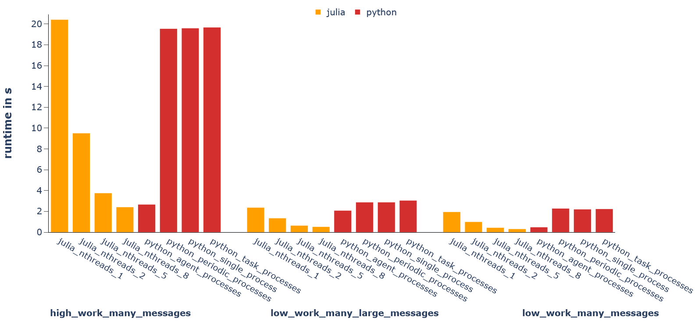

# Summary
Multi-agent simulations are inherently complex, making them difficult to implement, maintain, and optimize.
An agent, as defined by [@russel:2010], is software that perceives its environment through sensors and acts upon it using actuators.
`Mango.jl` is a simulation framework for multi-agent systems implemented in Julia [@julia:2017].
It enables quick implementations of multiple communicating agents, either spanning multiple devices or in a single local environment.

For the design process, `Mango.jl` provides a general structure and a role concept to help develop modular and loosely coupled agents.
This is aided by the built-in task scheduler, with convenience methods to easily schedule timed and repeated tasks that are executed asynchronously.

Agents communicate with each other via message exchange.
Each agent is associated with a container that handles network operations for one or more agents.
Messages may be sent directly via TCP connections or indirectly using an MQTT broker.
This way, `Mango.jl` makes it easy to set up multi-agent simulations on multiple hardware devices.

Mango agents can run in real-time or using simulated time, with either discrete event or stepped time versions.
This is useful for simulations, where simulated time should run much faster than real-time. These non-real-time simulation modes also enable the user to simulate the communication to validate the robustness of multi-agent systems against communication issues.


# Statement of need
Multi-agent systems are a large field with applications in distributed optimization [@yang:2019], reinforcement learning [@gronauer:2022], robotics [@chen:2019] and more.
Many of these systems are highly complex and feature heterogeneous and interacting actors.
This makes them inherently difficult to model and develop.
Thus, a structured development framework to aid this process is a valuable asset.

While `Mango.jl` is a general purpose multi-agent framework, we will focus on energy systems in the following as this is the domain the authors are most familiar with.

Many of the ideas for `Mango.jl` are based on the existing Python framework `mango` [@schrage:2024]. 
The main reason for this julia-based version is to allow better focus on simulation performance, enabling larger scales of multi-agent simulations.
This is especially relevant in the energy domain, where an increasing amount of energy resources (e.g. batteries and PV-generators) have distributed ownership, competing goals and contribute to the same power grid.
Large scale multi-agent simulations allow researchers to study the behavior of these participants in energy markets and grid simulations.

The Python version of `mango` has already been succesfully applied to various research areas in the energy domain, including coalition formation in multi-energy networks [@schrage:2023], distributed market participation of battery storage units [@tiemann:2022], distributed black start [@stark:2021], and investigating the impact of communication topologies on distributed optimization heuristics [@holly:2021].
New Julia-based projects using `Mango.jl` are in active development.

# Related Frameworks
To our knowledge, there is no Julia-based multi-agent framework with a focus on agent communication and distributed operation like `Mango.jl`.

`Agents.jl` [@agents:2022] is a multi-agent framework for modeling agent interactions in a defined space to observe emergent properties like in animal flocking behavior or the spreading of diseases. 
This puts it in line with frameworks like mesa [@mesa:2020] or NetLogo [@netlogo:2004].
These have a different scope than `Mango.jl` which is more focused on agent communication and internal agent logic for software applications.

JADE [@JADE:2001] and JIAC [@jiac:2013] are Java frameworks of similar scope but are not actively developed anymore. 
JACK [@jack:2005] provides a language and tools to implement communicating agents but is discontinued and proprietary.
The agentframework [@agentframework:2022] is based on JavaScript and has less focus on communication than `Mango.jl`.
Lastly, the original Python version of mango [@schrage:2024] is of course most similar in scope, but makes it more difficult to write high performance simulations, due to the use of `asyncio` and the lack of native multi-threading in Python.

# Performance


The performance of the Python and Julia versions of mango were benchmarked against each other. The results are shown in \autoref{fig:benchmark} and the relevant code is available at [mango_benchmark](https://github.com/OFFIS-DAI/mango_benchmark).

The aim of these scenarios is to measure the performance of the frameworks core features.
This mainly means it measures how efficiently tasks are scheduled and messages are sent and handled.
To achieve this, benchmark scenarios have agents set up in a small world topology communicating a fixed number of messages between each other while performing simulated workloads.
All workloads in the agents is entirely simulated by static delays.
Thus, the benchmarks assumes that workloads in Python and Julia are identical.

The main advantage of `Mango.jl` is in the ease of parallelization.
Python can in some cases reach similar performance using subprocesses for parallel execution to circumvent the limitations of the Python global interpreter lock.
Compared to native threads in Julia, however, this is more prone to issues with the operating system, because it requires large amounts of file handles to operate the subprocesses.
Overall, it is easier to get high performance from `Mango.jl`.


# Basic Example
In this example, we define two agents in two containers (i.e. at different addresses) that pass messages to each other directly via TCP.
Containers can be set up and equipped with the necessary TCP protocol.

```julia
using Mango
using Sockets: InetAddr, @ip_str

# Create the container instances with TCP protocol
container = Container()
container.protocol = TCPProtocol(address=InetAddr(ip"127.0.0.1", 5555))

container2 = Container()
container2.protocol = TCPProtocol(address=InetAddr(ip"127.0.0.1", 5556))
```

Now, we need to define the agents.
An agent in `Mango.jl` is a struct defined with the `@agent` macro.
We define a `TCPPingPongAgent` that has an internal counter for incoming messages.

```julia
@agent struct TCPPingPongAgent
    counter::Int
end
```

After creation, agents have to be registered to their respective container.

```julia
# Create instances of ping pong agents
ping_agent = TCPPingPongAgent(0)
pong_agent = TCPPingPongAgent(0)

# register each agent to a container and give them a name
register(container, ping_agent, "Agent_1")
register(container2, pong_agent, "Agent_2")
```

When an incoming message is addressed at an agent, its container will call the `handle_message` function for it. 
Using Julias multiple dispatch, we can define a new `handle_message` method for our agent.

```julia
import Mango.handle_message

# Override the default handle_message function for ping pong agents
function handle_message(agent::TCPPingPongAgent, message::Any, meta::Any)
    agent.counter += 1

    println(
        "$(agent.aid) got a message: $message." *
        "This is message number: $(agent.counter) for me!"
    )

    # doing very important work
    sleep(0.5)

    if message == "Ping"
        t = AgentAddress(meta["sender_id"], meta["sender_addr"], nothing)
        send_message(agent, "Pong", t)
    elseif message == "Pong"
        t = AgentAddress(meta["sender_id"], meta["sender_addr"], nothing)
        send_message(agent, "Ping", t)
    end
end
```

With all this in place, we can send a message to the first agent to start the repeated message exchange.
To do this, we need to start the containers so they listen to incoming messages and send the initating message.
The best way to start the container message loops and ensure they are correctly shut down in the end is the
`activate(containers)` function.

```julia
activate([container, container2]) do
    send_message(ping_agent, "Ping", address(pong_agent))

    # wait for 5 messages to have been sent
    while ping_agent.counter < 5
      sleep(1)
    end
end
```


# Acknowledgements
This work has been partly funded by the Deutsche Forschungsgemeinschaft (DFG, German Research Foundation) – 359941476.


# References